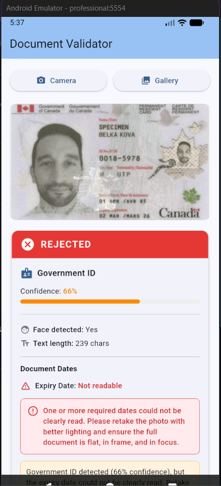
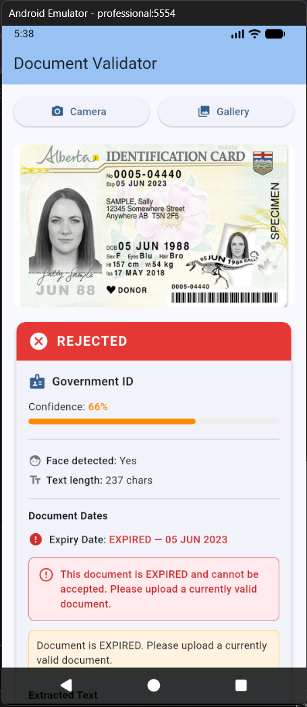

# Document Validator

A Flutter proof-of-concept that uses **on-device ML** to decide whether a photo is a real document image (ID, driver's license, insurance card, etc.) or something else (selfie, animal, blank wall).

Runs entirely on the device — no server, no API keys, no internet connection required.

---

## What it does

| Check | How |
|---|---|
| Detects text in the image | Google ML Kit Text Recognition (Latin) |
| Detects human faces | Google ML Kit Face Detection |
| Scores document keywords | Custom keyword list (license, insurance, address, …) |
| Gives a plain-English verdict | Combines the signals above |

---

## Screenshots

| Result 1 | Result 2 |
|---|---|
|  |  |

---

## Packages used

| Package | Version | Purpose |
|---|---|---|
| [`image_picker`](https://pub.dev/packages/image_picker) | ^1.1.2 | Camera / gallery picker |
| [`google_mlkit_text_recognition`](https://pub.dev/packages/google_mlkit_text_recognition) | ^0.15.1 | On-device OCR |
| [`google_mlkit_face_detection`](https://pub.dev/packages/google_mlkit_face_detection) | ^0.13.2 | On-device face detection |

> The umbrella `google_ml_kit` package is intentionally avoided — the plugin authors recommend adding only the specific ML Kit plugins you need to keep the app size small.

---

## Platform support

| Platform | Supported |
|---|---|
| Android | ✅ |
| iOS | ✅ |
| Web | ❌ (ML Kit does not support web) |
| Desktop | ❌ |

---

## Project structure

```
lib/
  main.dart                          ← App entry point
  pages/
    home_page.dart                   ← UI: pick image, show results
  services/
    document_validator_service.dart  ← ML logic (OCR + face detection)
  models/
    validation_result.dart           ← Result data class
```

---

## Getting started

### Prerequisites

- Flutter SDK ≥ 3.10
- Android device / emulator (API 21+) **or** a real iOS device
- For iOS: CocoaPods installed (`sudo gem install cocoapods`)

### 1 — Clone and install

```bash
git clone https://github.com/YOUR_USERNAME/document_validator.git
cd document_validator
flutter pub get
```

### 2 — iOS only — install pods

```bash
cd ios
pod install
cd ..
```

### 3 — Run

```bash
flutter run
```

---

## Android requirements

The ML Kit plugins require:

- `minSdkVersion` ≥ 21
- `compileSdkVersion` / `targetSdkVersion` ≥ 35

These are already set in [`android/app/build.gradle.kts`](android/app/build.gradle.kts).

---

## Permissions

### Android (`AndroidManifest.xml`)

```xml
<uses-permission android:name="android.permission.CAMERA" />
```

### iOS (`Info.plist`)

```xml
<key>NSCameraUsageDescription</key>
<string>This app uses the camera to scan and validate document images.</string>

<key>NSPhotoLibraryUsageDescription</key>
<string>This app uses your photo library so you can choose a document image.</string>
```

---

## How the validation logic works

```
image
  │
  ├─► OCR  ──► text length > 20 chars?  ──► looksLikeDocument = true
  │            has doc keywords?        ──► looksLikeDocument = true
  │
  └─► Face detection ──► face found + very little text? ──► "looks like a selfie"
```

A result is returned as a `ValidationResult` object:

```dart
ValidationResult(
  looksLikeDocument: true,
  hasFace: false,
  textLength: 142,
  extractedText: "DRIVER LICENSE\nJOHN DOE\n...",
  message: "This image appears to be a document.",
)
```

---

## Test cases to try

| Input | Expected result |
|---|---|
| Driver's license photo | Document detected, text found |
| Insurance card | Document detected, text found |
| Selfie | Face found, likely rejected |
| Animal photo | No face (usually), no text → rejected |
| Blank wall | No text → rejected |
| Nature photo | No text → rejected |

---

## Known limitations (v1)

- Some non-document images contain text (signs, packaging) and may pass
- A government ID with a photo will have both a face and text — this is handled: text length takes priority
- OCR alone cannot classify document *type* (ID vs license vs insurance)
- No blur or edge detection yet

---

## Roadmap

- [ ] Blur / sharpness detection
- [ ] Edge / rectangle detection (confirm document shape)
- [ ] Document type classification (ID / license / insurance / unknown)
- [ ] Confidence score output
- [ ] Enterprise integration module

---

## License

MIT


## Getting Started

This project is a starting point for a Flutter application.

A few resources to get you started if this is your first Flutter project:

- [Learn Flutter](https://docs.flutter.dev/get-started/learn-flutter)
- [Write your first Flutter app](https://docs.flutter.dev/get-started/codelab)
- [Flutter learning resources](https://docs.flutter.dev/reference/learning-resources)

For help getting started with Flutter development, view the
[online documentation](https://docs.flutter.dev/), which offers tutorials,
samples, guidance on mobile development, and a full API reference.
